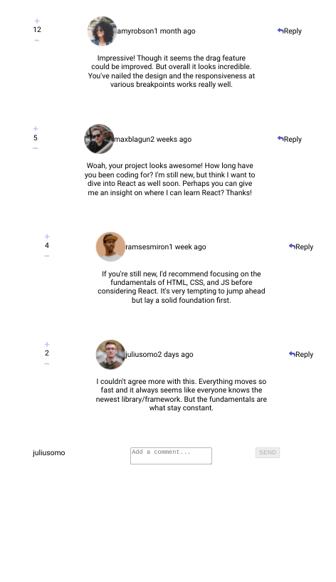

# Frontend Mentor - Interactive Comments Section

This is a solution to the [Interactive comments section challenge on Frontend Mentor](https://www.frontendmentor.io/challenges/interactive-comments-section-iG1RugEG9). Frontend Mentor challenges help you improve your coding skills by building realistic projects. 

## Table of contents

- [Overview](#overview)
  - [The challenge](#the-challenge)
  - [Screenshot](#screenshot)
  - [Links](#links)
- [My process](#my-process)
  - [Built with](#built-with)
  - [What I learned](#what-i-learned)
  - [Continued development](#continued-development)
  - [Useful resources](#useful-resources)

## Overview

### The challenge

Users should be able to:

- Create, Read, Update, and Delete comments and replies
- Upvote and downvote comments

### Screenshot

### Links

- Live Site URL: [Github Pages](https://jdegand.github.io/react-comments-section)

## My process

### Built with

- React

### What I learned

- My initial hesitation at changing the initial data.json file made this much harder.
- Flat data is best. 

### Continued development

- Edit Functionality
- Styling
- Limit clicking like button again w/ a flag or other method
- Real crud with database
- When you add a comment with short amount of text, it will look like a reply since the comment doesn't have a min-width.  
- Don't know why adding picture causes app to crash in CommentForm

### Useful resources

- [Pluralsight](https://www.pluralsight.com/guides/fetch-data-from-a-json-file-in-a-react-app) - fetch local data
- [FreeCodeCamp](https://www.freecodecamp.org/news/iterate-through-nested-object-in-react-js/) - iterate nested object in react
- [YouTube](https://www.youtube.com/watch?v=sjAeLwuezxo) - comments section tutorial 
- [Blog](https://alexsidorenko.com/blog/react-update-nested-state/) - update nested data
- [YouTube](https://www.youtube.com/watch?v=9YUnoZBXrlU) - Fetch / Destructure JSON
- [Blog](https://www.joshwcomeau.com/snippets/react-hooks/use-toggle/) - toggle
- [Stack Overflow](https://stackoverflow.com/questions/33111889/reactjs-elegant-way-to-toggle-state/53870547) - toggle state
- [YouTube](https://www.youtube.com/watch?v=EaU3AI7Yelc&list=PL9a7QRYt5fqnxmxDMglzfv9v47IygFkDe&index=13) - Comment section for YouTube clone